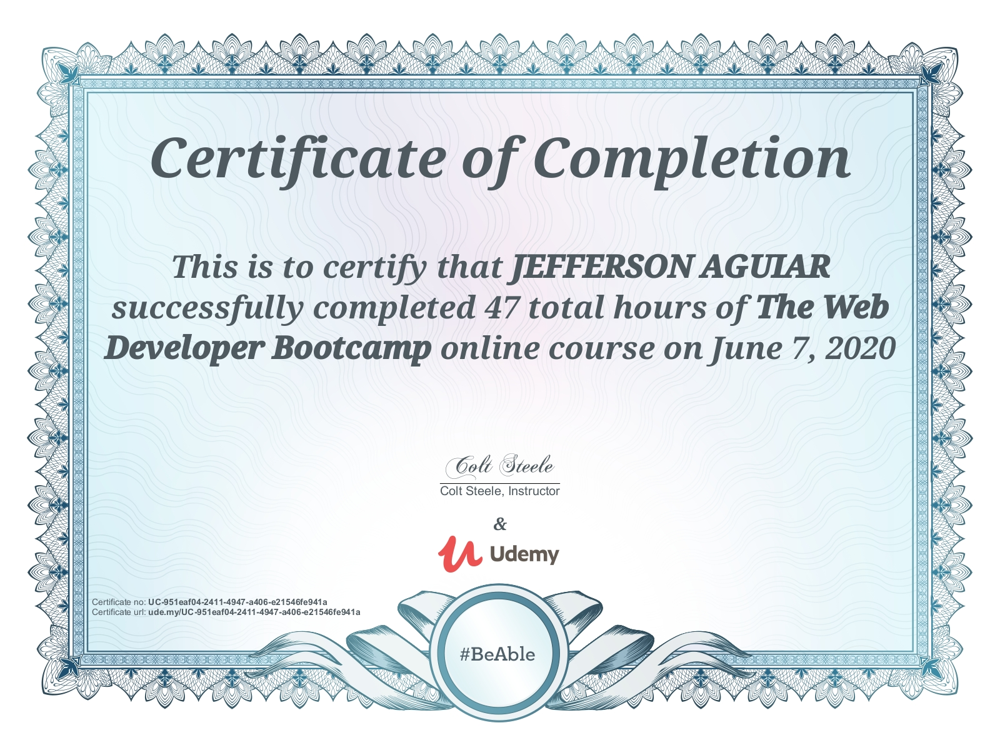

# Project Overview

This project was created in 2020 after receiving the following certificate:

> **This certificate above verifies that JEFFERSON AGUIAR successfully completed the course The Web Developer Bootcamp 2020 on 06/07/2020 as taught by Colt Steele on Udemy. The certificate indicates the entire course was completed as validated by the student. The course duration represents the total video hours of the course at the time of most recent completion.**

---

## About This Project

The main objective of this project is to showcase the skills and knowledge acquired during **The Web Developer Bootcamp**. After successfully completing the course and receiving the certificate from Udemy (instructor Colt Steele), the project was initiated to apply, reinforce, and demonstrate the concepts learned:

- **HTML5 and CSS3** fundamentals  
- **JavaScript** basics to advanced topics  
- Introduction to **Node.js** and **Express.js**  
- Working with **databases** (MongoDB)  
- Building and deploying **full-stack web applications**  

## Tech Stack

- **Frontend:** HTML5, CSS3, JavaScript  
- **Backend:** Node.js, Express.js  
- **Database:** MongoDB  

## License

This project is licensed under the MIT License.